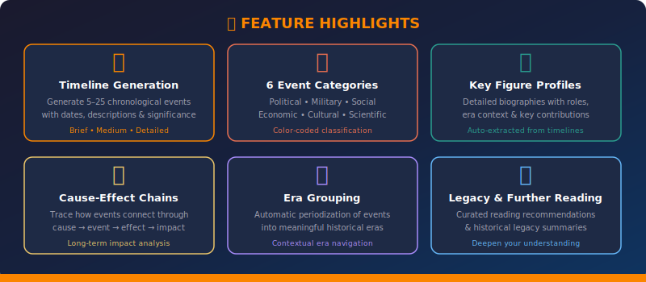
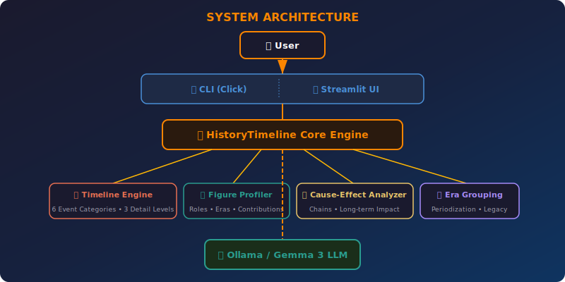

<div align="center">

  

  <br/><br/>

  <!-- Badges -->
  <a href="https://www.python.org/downloads/"></a>
  <a href="https://ollama.com"></a>
  <a href="https://streamlit.io"></a>
  <a href="https://click.palletsprojects.com"></a>
  <br/>
  <a href="#-license"></a>
  <a href="#-testing"></a>
  <a href="https://github.com/kennedyraju55/history-timeline-generator"></a>
  <a href="#-configuration"></a>
  

  
<br/><br/>

  <strong>Generate rich, AI-powered historical timelines with era grouping, key figure profiles,<br/>and cause-effect chain analysis — all running on your local machine.</strong>

  <br/><br/>

  Part of the <a href="https://github.com/kennedyraju55/90-local-llm-projects"><strong>90 Local LLM Projects</strong></a> collection &nbsp;•&nbsp; Project #57

  <br/>

</div>

<br/>

---

<div align="center">

### ⚡ Quick Links

[🚀 Quick Start](#-quick-start) · [💻 CLI Reference](#-cli-reference) · [🌐 Web UI](#-web-ui) · [🏗️ Architecture](#%EF%B8%8F-architecture) · [📖 API Reference](#-api-reference) · [⚙️ Configuration](#-configuration) · [❓ FAQ](#-faq)

</div>

---

<br/>

## 🤔 Why This Project?

Understanding history is hard. Building timelines from scratch is even harder. This project solves the **core pain points** historians, students, and curious minds face every day:

| # | Challenge | Without This Tool | With History Timeline Generator |
|---|-----------|-------------------|---------------------------------|
| 1 | **Scattered information** | Manually search dozens of sources, cross-reference dates and events | One command generates a **complete chronological timeline** with 5–25 events |
| 2 | **Missing context** | Events feel isolated without understanding *why* they happened | **Cause-effect chain analysis** traces how events connect across decades |
| 3 | **Forgetting key people** | Hard to track which figures shaped which era | **Key figure profiles** with roles, contributions, and era context |
| 4 | **No periodization** | Events are a flat list with no structure | **Era grouping** organizes events into meaningful historical periods |
| 5 | **Expensive cloud APIs** | GPT-4 / Claude API calls add up fast for research workflows | **100% local** — runs on Ollama with Gemma 3, zero API costs |

> **Bottom line:** Ask a question like *"French Revolution"* and get a structured timeline, key figures, cause-effect chains, era groupings, legacy analysis, and further reading recommendations — all generated locally in seconds.

<br/>

---

## ✨ Features

<div align="center">
  
</div>

<br/>

<table>
<tr>
<td width="50%">

### 📅 Timeline Generation
Generate **5–25 chronological events** with dates, descriptions, key figures, significance ratings, and category tags. Choose from three detail levels — `brief`, `medium`, or `detailed` — to control the depth of output.

</td>
<td width="50%">

### 🏷️ Six Event Categories
Every event is classified into one of six color-coded categories:
- 🔵 **Political** — governance, policy, diplomacy
- 🔴 **Military** — wars, battles, defense
- 🟣 **Social** — movements, culture shifts, demographics
- 🟡 **Economic** — trade, finance, industry
- 🟢 **Scientific** — discoveries, inventions, technology
- 🔵 **Cultural** — arts, literature, philosophy

</td>
</tr>
<tr>
<td width="50%">

### 👤 Key Figure Profiles
Automatically extract and profile the **most important historical figures** for any topic. Each profile includes:
- Full name and historical role
- Era and time period context
- Biographical summary
- List of key contributions

</td>
<td width="50%">

### 🔗 Cause-Effect Chain Analysis
Trace how historical events connect through a structured chain:

```
Cause → Event → Effect → Long-term Impact
```

Understand not just *what* happened, but *why* it happened and what it led to — across decades or even centuries.

</td>
</tr>
</table>

<br/>

---

## 🚀 Quick Start

### Prerequisites

| Requirement | Version | Purpose |
|-------------|---------|---------|
| [Python](https://python.org) | ≥ 3.9 | Runtime environment |
| [Ollama](https://ollama.com) | Latest | Local LLM inference engine |
| [Gemma 3](https://ollama.com/library/gemma3) | Any | Default language model |

### Installation

```bash
# 1. Clone the repository
git clone https://github.com/kennedyraju55/history-timeline-generator.git
cd history-timeline-generator

# 2. Install the package in development mode
pip install -e ".[dev]"

# 3. Start the Ollama service (if not already running)
ollama serve

# 4. Pull the Gemma 3 model (first time only)
ollama pull gemma3

# 5. Verify installation
history-timeline --help
```

### Your First Timeline

```bash
# Generate a medium-detail timeline of the French Revolution
history-timeline generate --topic "French Revolution" --detail medium
```

**Expected output:** A rich, color-coded table with 10–15 chronological events, era groupings, key themes, legacy analysis, and further reading recommendations.

<br/>


## 🐳 Docker Deployment

Run this project instantly with Docker — no local Python setup needed!

### Quick Start with Docker

```bash
# Clone and start
git clone https://github.com/kennedyraju55/history-timeline-generator.git
cd history-timeline-generator
docker compose up

# Access the web UI
open http://localhost:8501
```

### Docker Commands

| Command | Description |
|---------|-------------|
| `docker compose up` | Start app + Ollama |
| `docker compose up -d` | Start in background |
| `docker compose down` | Stop all services |
| `docker compose logs -f` | View live logs |
| `docker compose build --no-cache` | Rebuild from scratch |

### Architecture

```
┌─────────────────┐     ┌─────────────────┐
│   Streamlit UI  │────▶│   Ollama + LLM  │
│   Port 8501     │     │   Port 11434    │
└─────────────────┘     └─────────────────┘
```

> **Note:** First run will download the Gemma 4 model (~5GB). Subsequent starts are instant.

---


---


---

## ⚡ REST API

Every project includes a FastAPI REST API with auto-generated docs.

### Start the API Server

```bash
# Run directly
uvicorn src.history_timeline.api:app --reload --port 8000

# Or with Docker
docker compose up
```

### API Endpoints

| Method | Endpoint | Description |
|--------|----------|-------------|
| `GET` | `/health` | Health check |
| `GET` | `/docs` | Interactive Swagger UI |
| `GET` | `/redoc` | ReDoc documentation |
| `POST` | `/analyze` | Main analysis endpoint |

### Example Request

```bash
curl -X POST http://localhost:8000/analyze \
  -H "Content-Type: application/json" \
  -d '{"text": "your input here"}'
```

> 📖 Visit `http://localhost:8000/docs` for the full interactive API documentation.

## 💻 CLI Reference

The `history-timeline` CLI is built with [Click](https://click.palletsprojects.com) and [Rich](https://rich.readthedocs.io) for beautiful terminal output. All commands support the `--verbose / -v` flag for debug logging.

```
Usage: history-timeline [OPTIONS] COMMAND [ARGS]...

📜 History Timeline Generator — Create rich historical timelines.

Options:
  -v, --verbose  Enable verbose logging
  --help         Show this message and exit.

Commands:
  generate      Generate a historical timeline for a topic.
  figures       Get detailed profiles of key historical figures.
  cause-effect  Analyze cause-and-effect chains for a historical topic.
```

### `generate` — Create a Historical Timeline

Generate a structured timeline with events, eras, key themes, and legacy analysis.

```bash
history-timeline generate [OPTIONS]
```

| Option | Short | Required | Default | Description |
|--------|-------|----------|---------|-------------|
| `--topic` | `-t` | ✅ | — | Historical topic to research |
| `--detail` | `-d` | ❌ | `medium` | Detail level: `brief`, `medium`, or `detailed` |
| `--start` | `-s` | ❌ | — | Start year for the timeline range |
| `--end` | `-e` | ❌ | — | End year for the timeline range |
| `--output` | `-o` | ❌ | — | Save timeline to a JSON file |

**Detail Levels:**

| Level | Events | Description |
|-------|--------|-------------|
| `brief` | 5–8 | Major events with short descriptions |
| `medium` | 10–15 | Events with moderate detail |
| `detailed` | 15–25 | Comprehensive descriptions, key figures, and significance |

**Examples:**

```bash
# Brief overview of World War II
history-timeline generate -t "World War II" -d brief

# Detailed timeline with date range
history-timeline generate -t "Space Race" -d detailed -s 1957 -e 1972

# Save output as JSON for further processing
history-timeline generate -t "Industrial Revolution" -o revolution.json

# Verbose mode for debugging
history-timeline -v generate -t "Roman Empire" -d medium
```

**Sample Output Structure:**

```
╭──────────────────── 📜 Historical Timeline ─────────────────────╮
│ The French Revolution                                            │
│ Period: 1789 - 1799                                              │
│                                                                  │
│ The French Revolution was a period of radical political and      │
│ societal change in France that began with the Estates General... │
╰──────────────────────────────────────────────────────────────────╯

🏛️ Eras:
  [1789–1791] Constitutional Monarchy: The early phase...
  [1792–1794] Radical Republic: The most turbulent phase...
  [1795–1799] Directory: The conservative reaction...

┌─────────────── Timeline Events ───────────────┐
│ Date  │ Event           │ Description │ ...   │
├───────┼─────────────────┼─────────────┼───────┤
│ 1789  │ Storming of the │ On July 14  │ ...   │
│       │ Bastille        │ an armed... │       │
└───────┴─────────────────┴─────────────┴───────┘
```

### `figures` — Key Historical Figure Profiles

Extract detailed profiles of the most important figures related to a topic.

```bash
history-timeline figures [OPTIONS]
```

| Option | Short | Required | Description |
|--------|-------|----------|-------------|
| `--topic` | `-t` | ✅ | Historical topic to research figures for |

**Examples:**

```bash
# Get key figures from the Renaissance
history-timeline figures -t "Renaissance"

# Get figures from a specific conflict
history-timeline figures -t "American Civil War"
```

**Sample Output:**

```
╭───────────────── 👤 Key Figure ──────────────────╮
│ Leonardo da Vinci — Polymath, Artist, Inventor   │
│ Era: Italian Renaissance (1452–1519)             │
│                                                   │
│ Leonardo da Vinci was the quintessential          │
│ Renaissance man whose genius spanned art,         │
│ science, engineering, and anatomy...              │
╰──────────────────────────────────────────────────╯
  • Painted the Mona Lisa and The Last Supper
  • Designed early flying machines and tanks
  • Made groundbreaking anatomical studies
```

### `cause-effect` — Cause-Effect Chain Analysis

Analyze how historical events connect through cause → event → effect → long-term impact chains.

```bash
history-timeline cause-effect [OPTIONS]
```

| Option | Short | Required | Description |
|--------|-------|----------|-------------|
| `--topic` | `-t` | ✅ | Historical topic to analyze |

**Examples:**

```bash
# Analyze cause-effect chains of the French Revolution
history-timeline cause-effect -t "French Revolution"

# Trace chains in the Cold War
history-timeline cause-effect -t "Cold War"
```

**Sample Output:**

```
╭──────────── 🔗 Cause → Effect ─────────────╮
│ Cause:     Financial crisis and heavy       │
│            taxation of the Third Estate     │
│ Event:     Storming of the Bastille (1789)  │
│ Effect:    Collapse of royal authority and  │
│            establishment of the National    │
│            Assembly                         │
│ Long-term: Inspired democratic movements   │
│            worldwide for the next 200 years │
╰─────────────────────────────────────────────╯
```

<br/>

---

## 🌐 Web UI

The Streamlit-based web interface provides a rich, interactive experience for exploring historical timelines.

### Launch

```bash
streamlit run src/history_timeline/web_ui.py
```

The web UI opens at `http://localhost:8501` and provides:

| Tab | Description |
|-----|-------------|
| 📅 **Timeline Display** | Expandable event cards with category icons and color-coding |
| 👤 **Figure Cards** | Detailed profiles of key historical figures in card layout |
| 🔗 **Cause-Effect View** | Visual cause → event → effect chain diagrams |
| 🏛️ **Era Navigator** | Browse events grouped by historical era with period descriptions |

### Web UI Controls

- **Topic Input** — Enter any historical topic in natural language
- **Detail Level** — Select `brief`, `medium`, or `detailed` from the sidebar
- **Date Range** — Optionally constrain the timeline to a specific start/end year
- **Export** — Download generated timelines as JSON for further analysis

<br/>

---

## 🏗️ Architecture

<div align="center">
  
</div>

<br/>

The system follows a clean **layered architecture** with clear separation of concerns:

| Layer | Component | Responsibility |
|-------|-----------|----------------|
| **Interface** | `cli.py` | Click-based CLI with Rich terminal formatting |
| **Interface** | `web_ui.py` | Streamlit web application with interactive widgets |
| **Core** | `core.py` | Business logic, data models, LLM prompt engineering |
| **Infrastructure** | `common/llm_client.py` | Ollama HTTP client, model management |
| **External** | Ollama + Gemma 3 | Local LLM inference engine |

### Project Structure

```
57-history-timeline-generator/
│
├── src/
│   └── history_timeline/
│       ├── __init__.py              # Package metadata & exports
│       ├── core.py                  # Data models, prompt templates, LLM interaction
│       ├── cli.py                   # Click CLI commands + Rich display helpers
│       └── web_ui.py               # Streamlit web interface
│
├── tests/
│   ├── test_core.py                # Unit tests for core logic & data models
│   └── test_cli.py                 # CLI integration tests
│
├── common/                         # Shared utilities (LLM client, helpers)
│
├── docs/
│   └── images/
│       ├── banner.svg              # Project banner image
│       ├── architecture.svg        # System architecture diagram
│       └── features.svg            # Feature highlights graphic
│
├── config.yaml                     # Application configuration (LLM, detail levels)
├── setup.py                        # Package installation & entry points
├── requirements.txt                # Python dependencies
├── Makefile                        # Common development tasks
├── .env.example                    # Environment variable template
├── .gitignore                      # Git ignore rules
└── README.md                       # This file
```

### Data Flow

```
User Input (topic, detail, date range)
    │
    ▼
┌─────────────────────────────┐
│  CLI (Click) / Web UI       │  ← Interface layer
│  (Streamlit)                │
└─────────────┬───────────────┘
              │
              ▼
┌─────────────────────────────┐
│  core.py                    │  ← Business logic
│  ┌───────────────────────┐  │
│  │ generate_timeline()   │  │  → Timeline with events, eras, themes
│  │ get_figure_profiles() │  │  → List of KeyFigureProfile
│  │ get_cause_effect()    │  │  → List of CauseEffectChain
│  └───────────────────────┘  │
└─────────────┬───────────────┘
              │
              ▼
┌─────────────────────────────┐
│  common/llm_client.py       │  ← Infrastructure
│  chat() → Ollama HTTP API   │
└─────────────┬───────────────┘
              │
              ▼
┌─────────────────────────────┐
│  Ollama / Gemma 3           │  ← Local LLM
│  http://localhost:11434     │
└─────────────────────────────┘
```

<br/>

---

## 📖 API Reference

### Data Models

The `history_timeline.core` module exposes four dataclass models and three core functions.

#### `Timeline`

The top-level container returned by `generate_timeline()`. Holds all timeline data.

```python
from dataclasses import dataclass, field
from typing import List

@dataclass
class Timeline:
    title: str = ""                                    # Timeline title
    period: str = ""                                   # "Start Year - End Year"
    overview: str = ""                                 # Brief overview paragraph
    events: List[HistoricalEvent] = field(default_factory=list)
    key_themes: List[str] = field(default_factory=list)
    legacy: str = ""                                   # Long-term impact summary
    further_reading: List[str] = field(default_factory=list)
    eras: List[dict] = field(default_factory=list)     # {"name", "start", "end", "description"}
    key_figures: List[KeyFigureProfile] = field(default_factory=list)
    cause_effect_chains: List[CauseEffectChain] = field(default_factory=list)

    def to_dict(self) -> dict:
        """Serialize the entire timeline to a dictionary."""
        ...
```

#### `HistoricalEvent`

Represents a single event on the timeline.

```python
@dataclass
class HistoricalEvent:
    date: str = ""                        # Date or year (e.g., "July 14, 1789")
    event: str = ""                       # Event name/title
    description: str = ""                 # What happened
    key_figures: List[str] = field(default_factory=list)  # People involved
    significance: str = ""                # Why this matters
    category: str = ""                    # political|military|social|economic|cultural|scientific
```

**Category Values:**

| Category | Color (CLI) | Description |
|----------|-------------|-------------|
| `political` | 🔵 Blue | Governance, policy, diplomacy |
| `military` | 🔴 Red | Wars, battles, defense |
| `social` | 🟣 Magenta | Movements, demographics |
| `economic` | 🟡 Yellow | Trade, finance, industry |
| `cultural` | 🔵 Cyan | Arts, literature, philosophy |
| `scientific` | 🟢 Green | Discoveries, inventions |

#### `KeyFigureProfile`

A detailed profile of a historical figure.

```python
@dataclass
class KeyFigureProfile:
    name: str = ""                        # Full name
    role: str = ""                        # Title or role (e.g., "King of France")
    era: str = ""                         # Time period (e.g., "French Revolution")
    summary: str = ""                     # Brief biography
    key_contributions: List[str] = field(default_factory=list)  # Notable achievements
```

#### `CauseEffectChain`

A single cause-effect analysis chain.

```python
@dataclass
class CauseEffectChain:
    cause: str = ""                       # The root cause
    event: str = ""                       # The resulting event
    effect: str = ""                      # Immediate effect
    long_term_impact: str = ""            # Long-term historical impact
```

### Core Functions

#### `generate_timeline()`

Generate a complete historical timeline using the local LLM.

```python
from history_timeline.core import generate_timeline

timeline = generate_timeline(
    topic="French Revolution",       # Required: historical topic
    detail="medium",                 # Optional: "brief" | "medium" | "detailed"
    start_year="1789",               # Optional: constrain start year
    end_year="1799",                 # Optional: constrain end year
)

# Access timeline data
print(timeline.title)                # "The French Revolution"
print(len(timeline.events))          # 10-15 events (medium detail)
print(timeline.eras)                 # List of era dicts
print(timeline.legacy)              # Legacy summary

# Export to dictionary
data = timeline.to_dict()
```

| Parameter | Type | Required | Default | Description |
|-----------|------|----------|---------|-------------|
| `topic` | `str` | ✅ | — | Historical topic to research |
| `detail` | `str` | ❌ | `"medium"` | Detail level (`brief`, `medium`, `detailed`) |
| `start_year` | `str` | ❌ | `""` | Start year constraint |
| `end_year` | `str` | ❌ | `""` | End year constraint |

**Returns:** `Timeline` dataclass instance.

#### `get_figure_profiles()`

Get detailed profiles of key historical figures related to a topic.

```python
from history_timeline.core import get_figure_profiles

profiles = get_figure_profiles(
    topic="Renaissance",                 # Required: historical topic
    figures=["Leonardo da Vinci"],       # Optional: specific figures to focus on
)

for profile in profiles:
    print(f"{profile.name} — {profile.role}")
    print(f"Era: {profile.era}")
    print(f"Summary: {profile.summary}")
    for contribution in profile.key_contributions:
        print(f"  • {contribution}")
```

| Parameter | Type | Required | Default | Description |
|-----------|------|----------|---------|-------------|
| `topic` | `str` | ✅ | — | Historical topic |
| `figures` | `List[str]` | ❌ | `None` | Specific figures to profile |

**Returns:** `List[KeyFigureProfile]`

#### `get_cause_effect_chains()`

Analyze cause-and-effect chains for a historical topic.

```python
from history_timeline.core import get_cause_effect_chains

chains = get_cause_effect_chains(topic="World War I")

for chain in chains:
    print(f"Cause:     {chain.cause}")
    print(f"Event:     {chain.event}")
    print(f"Effect:    {chain.effect}")
    print(f"Long-term: {chain.long_term_impact}")
    print()
```

| Parameter | Type | Required | Description |
|-----------|------|----------|-------------|
| `topic` | `str` | ✅ | Historical topic to analyze |

**Returns:** `List[CauseEffectChain]`

#### `check_service()`

Check if the Ollama service is running and accessible.

```python
from history_timeline.core import check_service

if check_service():
    print("Ollama is running!")
else:
    print("Please start Ollama with: ollama serve")
```

**Returns:** `bool` — `True` if Ollama is reachable, `False` otherwise.

#### `load_config()`

Load application configuration from a YAML file.

```python
from history_timeline.core import load_config

config = load_config()                       # Default: config.yaml
config = load_config("custom_config.yaml")   # Custom path

print(config["llm"]["temperature"])          # 0.5
print(config["llm"]["max_tokens"])           # 8192
```

| Parameter | Type | Required | Default | Description |
|-----------|------|----------|---------|-------------|
| `path` | `str` | ❌ | `config.yaml` | Path to YAML configuration file |

**Returns:** `dict` — Parsed configuration dictionary.

<br/>

---

## ⚙️ Configuration

All configuration is managed through `config.yaml` in the project root:

```yaml
# Application settings
app:
  name: "History Timeline Generator"
  version: "1.0.0"
  log_level: "INFO"

# LLM settings
llm:
  model: "llama3"              # Ollama model name
  temperature: 0.5             # Creativity (0.0 = deterministic, 1.0 = creative)
  max_tokens: 8192             # Maximum response length
  base_url: "http://localhost:11434"  # Ollama API endpoint

# Available detail levels
detail_levels:
  - brief                      # 5-8 events
  - medium                     # 10-15 events
  - detailed                   # 15-25 events

# Event classification categories
event_categories:
  - political
  - military
  - social
  - economic
  - cultural
  - scientific

# Streamlit UI settings
streamlit:
  page_title: "📜 History Timeline Generator"
  layout: "wide"
```

### Key Configuration Options

| Setting | Default | Description |
|---------|---------|-------------|
| `llm.model` | `llama3` | Ollama model to use (e.g., `gemma3`, `llama3`, `mistral`) |
| `llm.temperature` | `0.5` | Controls randomness. Lower = more factual, higher = more creative |
| `llm.max_tokens` | `8192` | Maximum tokens in LLM response. Increase for detailed timelines |
| `llm.base_url` | `http://localhost:11434` | Ollama API endpoint |
| `app.log_level` | `INFO` | Logging level (`DEBUG`, `INFO`, `WARNING`, `ERROR`) |

### Environment Variables

Copy `.env.example` to `.env` and customize:

```bash
cp .env.example .env
```

<br/>

---

## 🧪 Testing

Run the full test suite with pytest:

```bash
# Run all tests
pytest tests/ -v

# Run with coverage report
pytest tests/ -v --cov=src/history_timeline --cov-report=term-missing

# Run only core logic tests
pytest tests/test_core.py -v

# Run only CLI integration tests
pytest tests/test_cli.py -v
```

### Test Structure

| File | Tests | Description |
|------|-------|-------------|
| `tests/test_core.py` | Data models, JSON parsing, timeline construction | Unit tests for core business logic |
| `tests/test_cli.py` | CLI commands, option parsing, output formatting | Integration tests for the CLI interface |

<br/>

---

## 🏠 Local LLM vs ☁️ Cloud AI

Why run your own LLM instead of calling an API?

| Dimension | Local LLM (This Project) | Cloud AI (GPT-4, Claude) |
|-----------|--------------------------|--------------------------|
| **💰 Cost** | Free after hardware | $0.01–0.06 per 1K tokens |
| **🔒 Privacy** | Data never leaves your machine | Data sent to third-party servers |
| **⚡ Latency** | ~2–10s depending on hardware | ~1–5s depending on load |
| **🌐 Internet** | Works completely offline | Requires active connection |
| **🎛️ Control** | Full control over model, temperature, prompts | Limited to API parameters |
| **📏 Rate Limits** | None — run as many queries as you want | Strict rate limits on free tiers |
| **🔧 Customization** | Swap models freely (Gemma, LLaMA, Mistral) | Locked to provider's model lineup |
| **💻 Hardware** | Requires GPU (8GB+ VRAM recommended) | No special hardware needed |

> **Recommendation:** For research, education, and personal exploration, a local LLM gives you unlimited, private, free access to powerful AI. Cloud APIs are better when you need the absolute highest quality output or lack GPU hardware.

<br/>

---

## ❓ FAQ

<details>
<summary><strong>Which Ollama models work best for historical timelines?</strong></summary>

<br/>

Any instruction-following model works, but we recommend:

| Model | Size | Quality | Speed | Best For |
|-------|------|---------|-------|----------|
| **Gemma 3** | 4B–27B | ⭐⭐⭐⭐ | Fast | Balanced quality and speed |
| **LLaMA 3** | 8B–70B | ⭐⭐⭐⭐⭐ | Medium | Best overall quality |
| **Mistral** | 7B | ⭐⭐⭐ | Fast | Quick brief timelines |

Update the model in `config.yaml` under `llm.model`.

</details>

<details>
<summary><strong>How accurate are the generated timelines?</strong></summary>

<br/>

The timelines are generated by a language model and should be treated as **starting points for research**, not authoritative sources. LLMs can hallucinate dates, conflate events, or omit important context.

**Best practices:**
- Cross-reference key dates with established sources
- Use the `further_reading` suggestions to verify claims
- Start with `brief` detail for overview, then drill into specific periods with `detailed`
- Constrain date ranges with `--start` and `--end` for more focused results

</details>

<details>
<summary><strong>Can I generate timelines for non-Western history?</strong></summary>

<br/>

Yes! The tool works for any historical topic the underlying LLM has been trained on. Examples:

```bash
history-timeline generate -t "Mughal Empire" -d detailed
history-timeline generate -t "Meiji Restoration" -d medium
history-timeline generate -t "Mali Empire" -d medium
history-timeline generate -t "Chinese Civil War" -s 1927 -e 1949
```

Quality may vary based on the model's training data coverage for different regions and time periods.

</details>

<details>
<summary><strong>How do I increase the number of events generated?</strong></summary>

<br/>

Two approaches:

1. **Use the `detailed` level** — generates 15–25 events:
   ```bash
   history-timeline generate -t "World War II" -d detailed
   ```

2. **Increase `max_tokens` in `config.yaml`** — the model may truncate responses if the token limit is too low:
   ```yaml
   llm:
     max_tokens: 16384  # Double the default
   ```

3. **Narrow the date range** — focusing on a shorter period yields denser event coverage:
   ```bash
   history-timeline generate -t "World War II" -d detailed -s 1942 -e 1945
   ```

</details>

<details>
<summary><strong>Can I export timelines to other formats?</strong></summary>

<br/>

Currently, the CLI supports **JSON export** via the `--output` flag:

```bash
history-timeline generate -t "Cold War" -o cold_war.json
```

The JSON output contains all timeline data (events, eras, figures, cause-effect chains) and can be consumed by any tool or script. The `Timeline.to_dict()` method makes it easy to integrate with other Python applications.

</details>

<br/>

---

## 🤝 Contributing

Contributions are welcome! Here's how to get started:

```bash
# 1. Fork the repository on GitHub

# 2. Clone your fork
git clone https://github.com/YOUR_USERNAME/history-timeline-generator.git
cd history-timeline-generator

# 3. Create a feature branch
git checkout -b feature/your-feature-name

# 4. Install in development mode
pip install -e ".[dev]"

# 5. Make your changes and add tests

# 6. Run the test suite
pytest tests/ -v

# 7. Commit and push
git add .
git commit -m "feat: add your feature description"
git push origin feature/your-feature-name

# 8. Open a Pull Request on GitHub
```

### Areas for Contribution

- 🌍 **Multilingual support** — generate timelines in different languages
- 📊 **Visualization** — add chart.js or D3 timeline visualizations
- 🗃️ **Export formats** — CSV, Markdown, HTML export options
- 🧪 **More tests** — increase coverage of edge cases
- 📚 **New analysis modes** — thematic analysis, comparative timelines

<br/>

---

## 📝 License

This project is licensed under the **MIT License** — see the [LICENSE](LICENSE) file for details.

You are free to use, modify, and distribute this software for any purpose.

<br/>

---

<div align="center">

  

  <br/><br/>

  **📜 History Timeline Generator** — Part of the [90 Local LLM Projects](https://github.com/kennedyraju55/90-local-llm-projects) collection

  <br/>

  <sub>Made by <a href="https://github.com/kennedyraju55">Kennedy Raju</a> · Star ⭐ if you find this useful!</sub>

</div>
